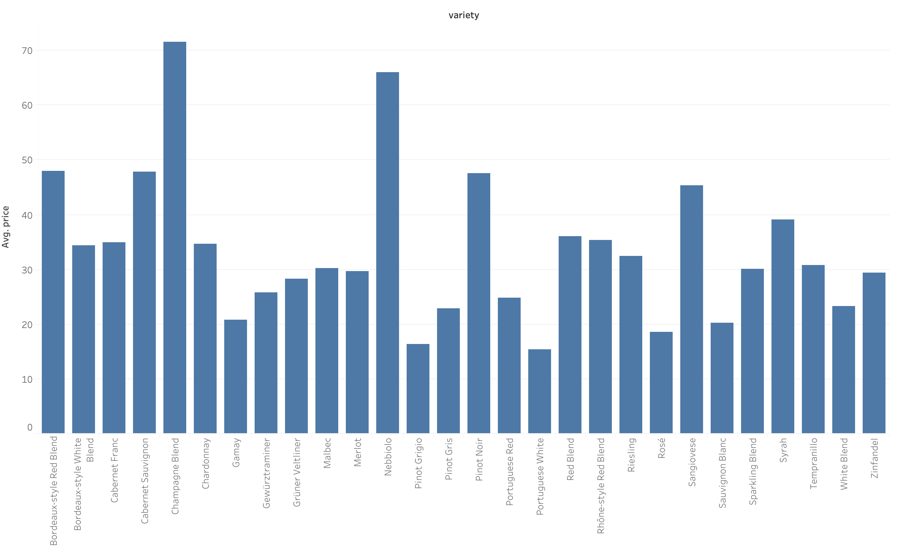
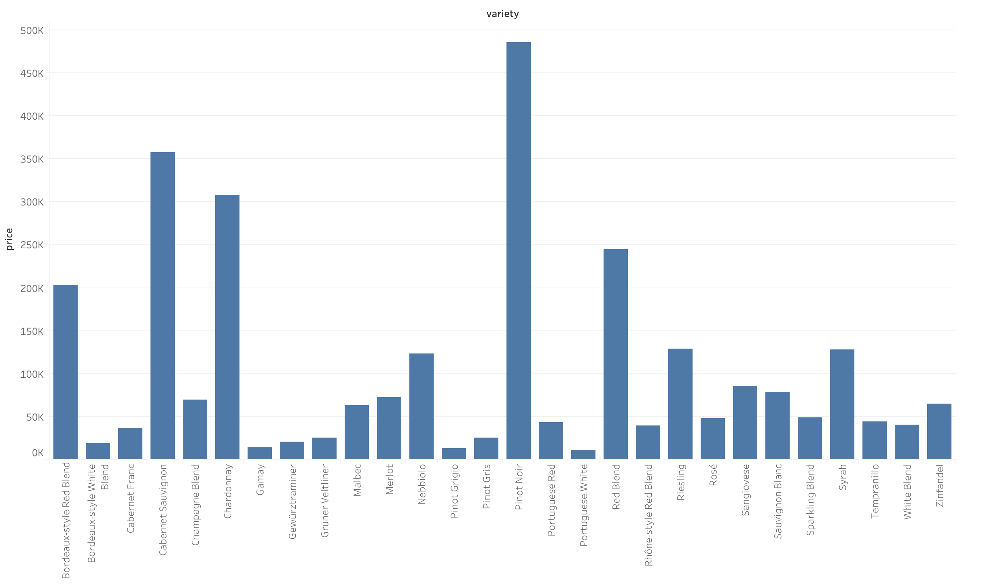
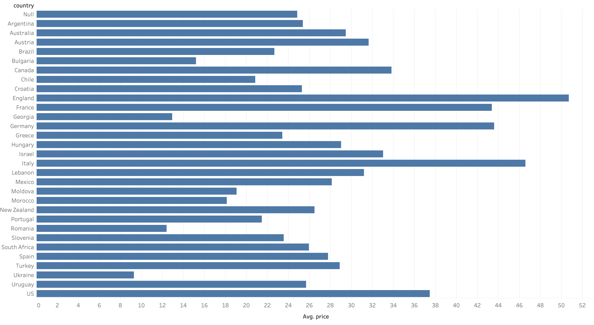
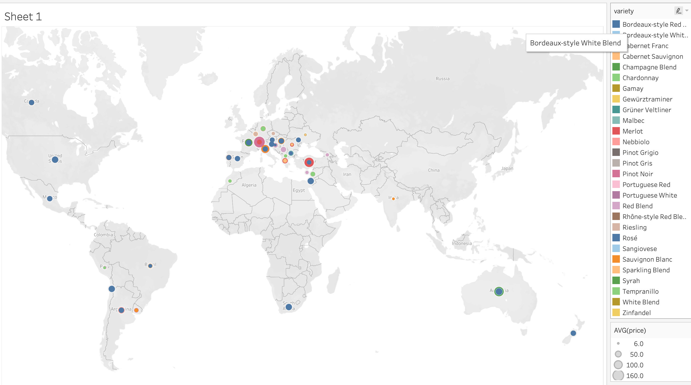
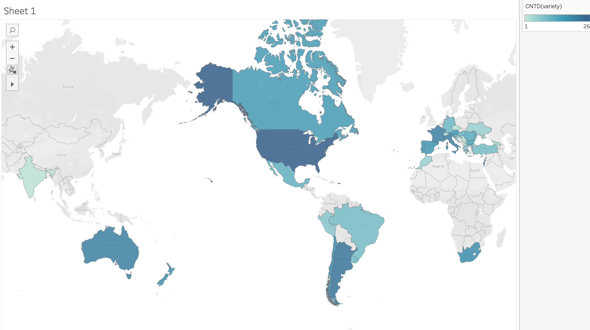

# Knight-ML-Assignment
Wine variety prediction

The model used is a 3-Layer Neural Network:
1st Layer - 100 dimensional FC layer with ReLU activation
2nd Layer - 100 dimensional FC layer with ReLU activation
3rd Layer - 29 dimensional FC layer with Sigmoid activation
Adam optimizer with categorical cross entropy was used

The features extracted were words from the reviews generated by the sklearn countTokenizer

Training Accuracy = 70%

Price of different Varieties of Wine

Popular Wines

Country

Distribution of Wine

Varieties of Wine across the world
